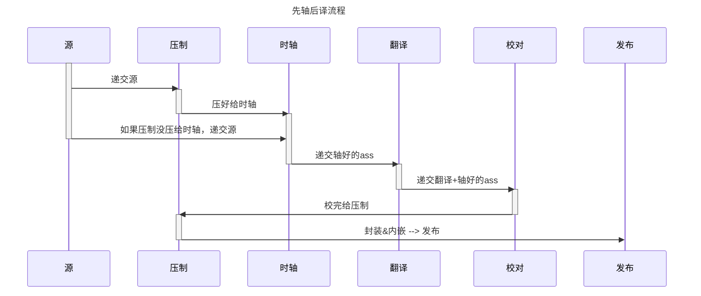
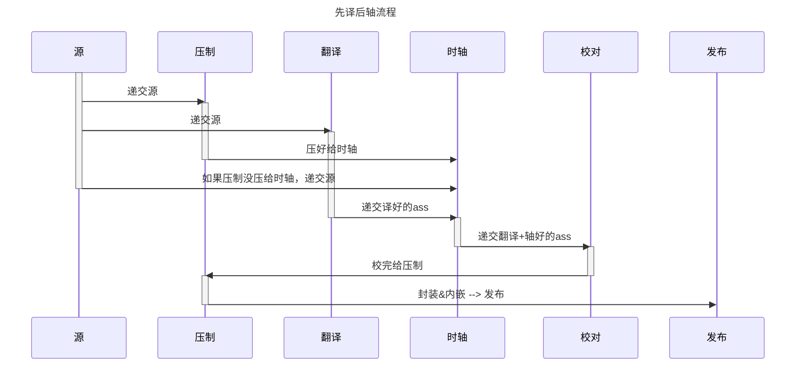

## 流程介绍

### 先轴后译流程

先轴后译需要翻译者学会Aegisub的基本使用

### 先译后轴流程

## 各环节工作内容概述

### 源

在2024年的今天，初学者接触到的源都是Web源，也就是世界各地流媒体网站的源。  
这些资源一般由搬运组搬运，只要稍微了解BT圈，即可轻松找到连载期间全网最清晰的Web源。  
所以任何人都可以轻易地获取源，这就不需要单独的职位专门去找源了，除非需要找官方日语字幕(后简称日字)。

### 翻译

如果没有日字，很遗憾，翻译者需要完全听译了。  
如果不打算制作双语字幕(即包含中日文的字幕)，翻译者可以直接写中文，否则需要先写日文再译中文。  
可能有些组不要求翻译会使用Aegisub，而是使用文档，这样的话就无法使用先轴后译流程了。

### 时轴

在 ASS 中“打”出字幕的起始点，实际为操作 Aegisub 点一点。  
乍看起来相当简单，实际上确实没有上手难度，但若想打得又快又好，还是需要一定量的练习、以及对时轴的理解。  
如果翻译会打轴，那就完美了，边轴边译。

### 校对

每个组的校对负责的内容不一样，这里介绍我认为最好的。  
校对者需要将完整的 ASS 文件载入播放器，直接观看成品效果，  
改正翻译和时轴的问题。  
这么看来，校对需要很强的外语技术和时轴能力。

### 压制

压制者需要了解视音频基础知识、会使用基本的工具处理视频。  
基本的处理操作是内嵌和内封，不会这两个操作就完全无法得到视频成品，  
还需要会调整编码器参数，目的是让成品压缩率更高。  
如果预处理，目的是为了更高的画质(这里的画质是个人主观感受，每个人观感不一样)。

### 后期

每个组对后期这一职位的定义不一样，这里说我的定义。  
流程图里没写后期，但在完善的字幕制作流程里，后期这一职位是必不可少的。  
后期需要负责流程规划(如果组里有人事部门那就可以丢给人事了)、字幕样式统筹、屏幕字和特效制作，  
需要相当多的字幕知识储备，至少要大致了解各流程。  
屏幕字和特效就需要对 ASS 标签以及对 Aegisub 自动化脚本 + 相关工具的熟练度了。
