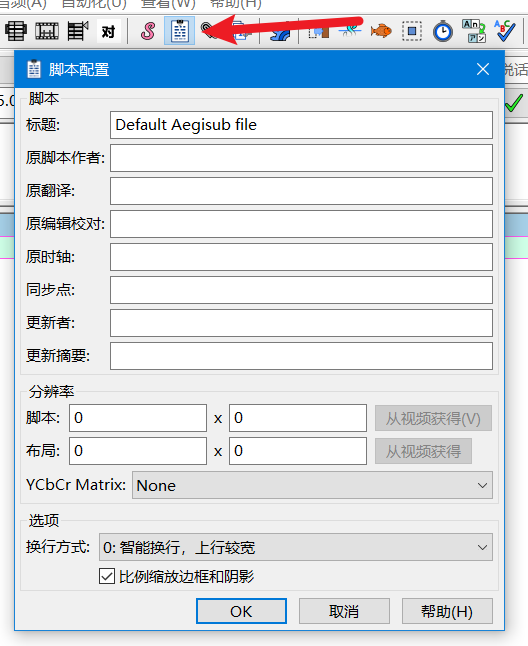

## 概述

本篇文章讲解 ASS 格式的大致结构，以及 Aegisub 的一些基本操作  
理解 ASS 的结构框架十分重要，建议所有职位都掌握此概念  
先理解框架，再动手实践、尝试制作，实践期间遇到障碍，应合理利用搜索引擎查询相关资料  
关于 ASS 格式，完整内容可以直接看这篇[ASS 字幕格式规范](https://github.com/weizhenye/ASS/wiki/ASS-%E5%AD%97%E5%B9%95%E6%A0%BC%E5%BC%8F%E8%A7%84%E8%8C%83)

## 新建ASS
>
> **打开Aegisub，新建一个ass，随便新建几行字幕：**  
> 

> **打开样式管理器：**  
> 

> **可以很轻松地更改各个样式，例如新建一个名为 `ABC` 的样式，将这个样式的字体设为宋体：**  
> 

> **保存这个ass，然后用Windows自带的记事本打开它，可以发现它是个文本文件：**  
> 

也就是说，ass文件是把所有的信息都以文字的方式记录起来，所以我们可以直接看出来这个ass里有哪些信息

## 了解ASS格式框架

### \[Script Info\]

观察ASS文件的文本内容，第一行写着 `[Script Info]`  

这行下面的部分就是 `[Script Info]` 的内容，字面意思——脚本信息。这些内容记录着这个ass脚本的基本信息：

```
; Script generated by Aegisub 9706-cibuilds-20caaabc0
; http://www.aegisub.org/
```

前2行是Aegisub生成的软件版本信息，以`;`开头，属于注释行，对ass来说没有用

```
Title: Default Aegisub file
ScriptType: v4.00+
WrapStyle: 0
ScaledBorderAndShadow: yes
YCbCr Matrix: None
```

而这5行就是标准的 ASS Script Info  
> **这里的信息也可以在Aegisub中修改**  
> 

`YCbCr Matrix` 不要设为 `601` 或 `None`，否则在 Aegisub 里预览的视频会偏色，但不会导致字幕filter渲染出来的字幕颜色改变，具体原因我也不清楚。  
如果预览的视频偏色，在这个预览视频中取色制作屏幕字的话，屏幕字就会偏色，所以把YCbCr Matrix设置为TV.709很重要。  

`WrapStyle` 对应 Aegisub 里的 `换行方式`，默认 `0` 即可，在字幕长度超出屏幕边界时，这个选项决定什么时候换行。  

`ScaledBorderAndShadow` 对应 Aegisub 里的 `比例缩放边框和阴影`，一定要记得勾选，否则播放时，只要改变播放器窗口大小，字幕样式就会变化。  

`PlayResX` 和 `PlayResY` 对应 Aegisub 里 `分辨率:脚本` 这个选项也是迷惑了很多新手，这个选项不会导致字幕渲染时的分辨率，这个选项的意思是，这个字幕将在一个什么比例的窗口里渲染。  
例如把分辨率设置为 `100 x 100`，将一行字幕的头部位置放在 `(0,0)` 点上，那么这个字幕就会从 `(0,0)` 点开始渲染，如果这行字幕每个字大小是 **10像素**，并且这行字幕超过了 **10个字** (也就是说渲染长度将超过100像素)，那么这行字幕的尾部就会触碰到设定的 `100 x 100` 这个窗口的边缘，然后根据上面提到的 `WrapStyle` 决定换不换行。  
分辨率这个选项一旦设定，最好不要更改，否则很有可能导致样式出问题。

`LayoutResX` 和 `LayoutResY` 对应的是 Aegisub 里的 `分辨率:布局`，这个参数会告诉渲染器如何拉伸布局，不设置或错误地设置可能会导致字体异常拉伸，大家看一些非 16:9 的老片时大概注意到过 ASS 渲染出来的文字被拉伸了，就是没有设置这个参数导致的。

### \[Aegisub Project Garbage\]

第二块内容的是 `[Aegisub Project Garbage]`  
这块的内容就是字面意思——Aegisub产生的垃圾内容。所以删掉也没有影响。

某些在制作字幕时可能有点用的信息会记录在这里，例如上次打开的视频、音频、关键帧等文件，最后选中的行……

### \[V4+ Styles\]

第三块内容是 `[V4+ Styles]`  
这行下面的部分是这个字幕文件的样式表，怎么肉眼查看这个表呢？其实很简单，先看第一行：  

```
Format: Name, Fontname, Fontsize, PrimaryColour, SecondaryColour, OutlineColour, BackColour, Bold, Italic, Underline, StrikeOut, ScaleX, ScaleY, Spacing, Angle, BorderStyle, Outline, Shadow, Alignment, MarginL, MarginR, MarginV, Encoding
```

这行以 `Format:` 作为开头，代表着这行记录着这个表的格式，也就是说这里记录着表的每列的类型是啥，用逗号分隔——第一列的类型是 Name，第二列的类型是 Fontname，以此类推。  

再看这个表的内容部分：

```
Style: Default,Arial,48,&H00FFFFFF,&H000000FF,&H00000000,&H00000000,0,0,0,0,100,100,0,0,1,2,2,2,10,10,10,1
Style: ABC,宋体,64,&H00FFFFFF,&H000000FF,&H42424242,&H00000000,0,0,0,0,100,100,0,0,1,3,0,2,0,0,40,0
```

每行以 `Style:` 作为开头，代表这行是一个样式，比如第一行样式的Name是Default，Fontname是Arial，以此类推；  
第二行样式的Name是ABC，Fontname是宋体……

> **好在我们不需要在记事本里更改样式，如下图所示，Aegisub的样式编辑器提供了更改这些样式的值的GUI**  
> 

为什么要像这样存储样式呢？  
仔细想一想就能理解——假设一集有 300 行对话，我想让这 300 行对话以同一种方式渲染，那么我就需要给每行都标注相同的样式，如果每行都详细标注样式的各种值的话，那就太繁琐、太多信息冗余了，  
所以像这样把经常用得到的样式提前写好，然后给这个样式起个名字，在某行需要用这个样式的时候，给这行标注上这个样式的名字，即可达成目的。

### \[Events\]

最后一部分 `[Events]`  
就是字幕的主要内容了，也就是事件，每行都是一个渲染事件，一次渲染字幕的行为。  

先看第一行：

```
Format: Layer, Start, End, Style, Name, MarginL, MarginR, MarginV, Effect, Text
```

和前文的样式表一样，主体部分也是个表，事件表。第一行同理，它标注了这个表每列的类型。  

看内容部分：

```
Dialogue: 0,0:00:00.00,0:00:05.00,Default,,0,0,0,,
Dialogue: 0,0:00:05.00,0:00:07.00,Default,,0,0,0,,
Dialogue: 0,0:00:07.00,0:00:09.00,Default,,0,0,0,,
Dialogue: 0,0:00:09.00,0:00:11.00,Default,,0,0,0,,
Dialogue: 0,0:00:11.00,0:00:13.00,Default,,0,0,0,,
Dialogue: 0,0:00:13.00,0:00:15.00,Default,,0,0,0,,
```

例如 `Default` 这个内容就对应着 `Style` 这个类型，也就是样式名，代表着这行以这个样式作为基础渲染。  

> **行首为 `Dialogue` 表示这行会正常渲染，如果在Aegisub里将这行注释掉，如下图所示：**  
> 

行首就会变成 `Comment`，这行就不会渲染。

*如果 Event 行中使用了 Styles 中没有的样式名，且 Styles 中有 `Default` 样式，该行的样式会回退到 `Default`*
